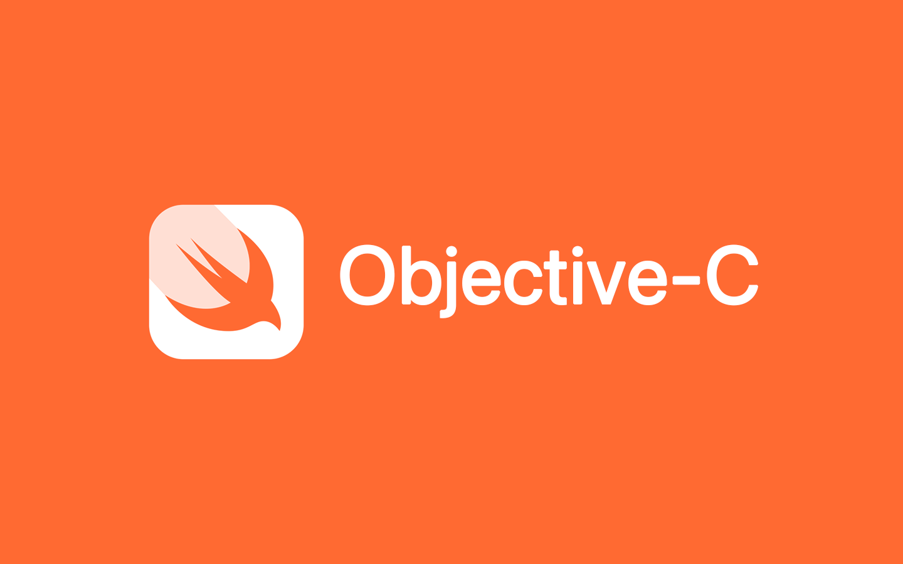

Timeline

- May 2019: [@samdbeckham](https://github.com/samdbeckham)'s legendary javascript-java sticker ([website](https://samdbeckham.gitlab.io/javascript_sticker/)) ([tweet](https://twitter.com/samdbeckham/status/1129722966118457344))
- Aug 2019: [@mkrl](https://github.com/mkrl)'s misbrand repo ([repo](https://github.com/mkrl/misbrands))
- May 2022: [@ohmyhub](https://github.com/ohmyhub)'s fork ([repo](https://github.com/ohmyhub/misbrands))
- Feb 2024: [@pReya](https://github.com/pReya)'s fork ([repo](https://github.com/pReya/cursed-programming-stickers))
- Mar 2024: This fork!

FAQ

### Can I print these?
Of course, that's why those are here.

### Can I buy these?
Yes, you can! Not from me, but from any custom sticker vendor of your choice.

### Will there be more?
This is a fork of the original repo that hadn't been updated in some time. I'm
working on adding new logos that were submitted as pull requests to the original
repo.

### How do I make a misbrand?
To make a misbrand, choose two existing brands. Generally the fanbase for the
brands have as much overlap (eg: Rust & Golang) and/or contention (eg: Vim & VSCode)
as possible or the brands have similar market niches (eg: OpenVPN & NordVPN).

Once the two victum brands are chosen. Take the style (eg: theme/design) of one
brand and join it with the text of the other brand. Viola!

Check the FAQ for more resources on DIY-ing a misbrand

### How do I find images/logos for brands?
- Look for the 'Press' or 'Media' section on the website, there will usually be assets that make a good starting place
- Search the codebase for `svg`

### How do I create an svg?

If you don't know where to start, use Inkscape ([website](https://inkscape.org))
([gitlab](https://gitlab.com/inkscape/inkscape)). There are tutorials and resources
online, just search for 'How do I do XYZ in inkscape?'

### I have a misbrand. How do I contribute?
There are two ways to submit a misbrand:

- Issue: Create an issue on this repo with the image!
- Pull Request: Click the fork button, add the image to your copy of this repo, go to 'Pull Requests' and click 'New pull requests'
    - Please follow the file and commit conventions below

Naming Convention

There are two naming conventions:
- One for files to make them easier to find and understand
- One for submitting images you didn't create

### Files

For all the images, our convention is
- `{text}-{style}.svg`

Example: The text says python in the logo style of php. `python-php.svg`

If there is a file with that name already existing simply add a dash and a
number starting with 02 and incrementing up from there.

Example: You submit a misbrand that says emacs in the style of the vim,
there is already an `emacs-vim.svg` in the repo. Name your file `emacs-vim-02.svg`.

### Commits

- If you created the image, do whatever you want for the commit message!
- If you are adding an image you didn't create, structure the message like so:
    - `{text} in the style of {style} (credit @{user}) <{url}>`
    - Where `{user}` is the user who created the image
    - And `{url}` is the repo/website the image came from

Misbrands

apple

### latex

atom

### reactjs

aws

### azure

azure

### aws

bootstrap

### wordpress

brainfuck

### python

cargo

### docker

cmd

### bash

counterstrike

### css

cpp

### rust

### scala

dart

### kotlin

debian

### ubuntu

discord

### skype

### skype

django

### rails

dotnet

### php

elixir

### erlang

emacs

### eclipse

erlang

### elixir

facebook

### fedora

fedora

### manjaro

ggplot2

### matplotlib

github

### gitlab

gitlab

### github

go

### rust

google

### stackoverflow

gtk

### reactjs

haskell

### perl

helix

### neovim

inkscape

### adobe

javascript

### java

jetbrains

### neovim

jquery

### angular

kafka

### rabbitmq

kotlin

### dart

lisp

### npm

mariadb

### mysql

mysql

### mariadb

### mongodb

neovim

### helix

nginx

### apache

objectivec

### swift

openvpn

### nordvpn

php

### python

pip

### npm

postgresql

### mongodb

### php

python

### cpp

### go

### php

pytorch

### tensorflow

qt

### gtk

r

### rust

racket

### halflife2

rails

### wordpress

react

### angular

redhat

### suse

ruby

### python

rust

### go

### nodejs

### r

samsung

### huawei

shellscript

### kubernetes

spring

### rails

stackoverflow

### google

suse

### redhat

teams

### jira

tensorflow

### pytorch

### sklearn

threema

### signal

twitter

### reddit

ubuntu

### debian

vi

### intellij

vim

### emacs

### emacs

visualstudio

### intellij

vscode

### sublimetext

### vim

webpack

### esbuild

windowsserver

### archlinux

zig

### php

